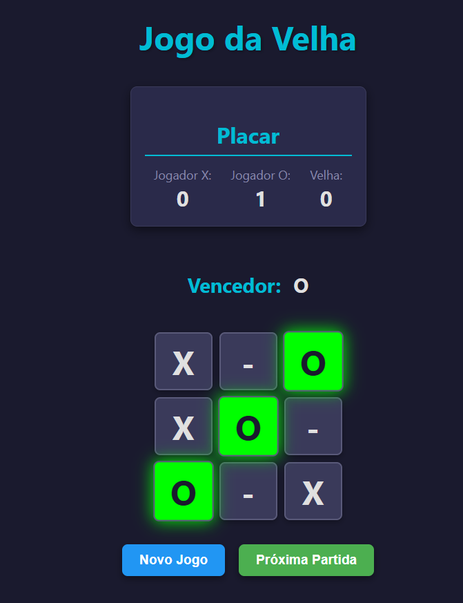

# Jogo da Velha (Tic-Tac-Toe) 

Este é um projeto simples de Jogo da Velha (Tic-Tac-Toe) implementado com HTML, CSS e JavaScript. É um jogo clássico de dois jogadores, onde o objetivo é conseguir três de seus símbolos (X ou O) em linha, coluna ou diagonal para vencer!

## 🎮 Funcionalidades 

*   **Gameplay Clássico:** Desfrute da experiência tradicional do Jogo da Velha com todas as regras conhecidas.
*   **Interface Intuitiva:** Um design limpo e fácil de usar, permitindo que jogadores de todas as idades comecem a jogar instantaneamente.
*   **Indicador de Turno:** Saiba sempre qual jogador (X ou O) é o próximo a jogar, com um destaque visual claro.
*   **Detecção Inteligente de Fim de Jogo:** O jogo detecta automaticamente vitórias (três em linha) e empates, exibindo uma mensagem clara ao final da partida.
*   **Reinício Rápido:** Uma opção simples para reiniciar o jogo a qualquer momento, permitindo novas partidas sem recarregar a página.
*   **Responsividade:** Adaptável a diferentes tamanhos de tela, proporcionando uma boa experiência tanto em desktops quanto em dispositivos móveis.
*   **Feedback Visual:** Células preenchidas são claramente marcadas, e a linha vencedora é destacada para maior clareza.

## 💻 Tecnologias Utilizadas 

*   **HTML5:** 
*   **CSS3:** 
*   **JavaScript:** 


## 📸 Screenshot 

Uma imagem do jogo em ação:




## 🚀 Como Jogar 

1.  **Clone o repositório:**
    ```bash
    git clone https://github.com/rodrisoares/jogo-da-velha.git
    ```
2.  **Navegue até o diretório do projeto:**
    ```bash
    cd jogo-da-velha
    ```
3.  **Abra o arquivo `index.html` em seu navegador web.**
    Você pode simplesmente clicar duas vezes no arquivo `index.html` ou arrastá-lo para a janela do seu navegador.

    O jogo será iniciado automaticamente. Clique nas células do tabuleiro para fazer sua jogada.

